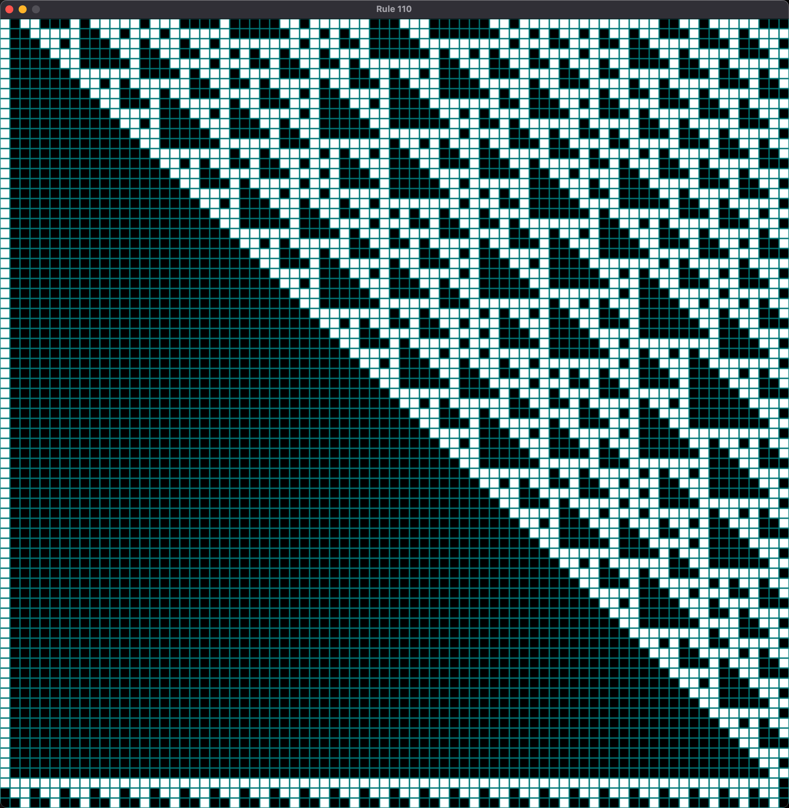

# Rule 110 (1-D Cellular Automaton) — Pygame Visualizer

A tiny Pygame app that visualizes Rule 110, an elementary 1-D cellular automaton (in the same group as Conway’s 2-D Game of Life). It renders each generation as a row of cells, growing upward; when the screen fills, it scrolls.



```shell
python -m venv .venv
source .venv/bin/activate  # Windows: .\.venv\Scripts\activate
pip install -r requirements.txt

python rule110.py
```

> [!NOTE]
> If running headless or via SSH, you’ll need a display (X11/Wayland) or SDL dummy driver.

## What you’ll see

- White = alive, black = dead
- Teal gridlines
- Optional green flash when animating cell-by-cell
- New generations appear above the previous ones; once full, the grid scrolls.

## Controls

- Autoplay: enabled by default (see AUTOPLAY below).
- Single-step: set AUTOPLAY = False, then press any key to advance one generation.
- Quit: close the window.

## Configuration (edit constants at the top of the file)

| Name               | Meaning                                     | Default |
| ------------------ | ------------------------------------------- | ------- |
| `CELLS_PER_ROW`    | Cells in each generation                    | `79`    |
| `CELL_SIZE_PX`     | Cell size in pixels                         | `15`    |
| `DISPLAY_ROWS`     | Number of rows on screen (height in cells)  | `79`    |
| `CELL_DRAWTIME_MS` | Per-cell highlight time (green flash)       | `0.0`   |
| `ROW_DRAWTIME_MS`  | Delay between drawing rows (ms)             | `25.0`  |
| `EVENT_LOOP_MS`    | Idle delay to keep UI responsive (ms)       | `10.0`  |
| `AUTOPLAY`         | `True` for continuous play; `False` to step | `True`  |

**Seed**: The default seed pattern sets every 3rd cell alive (`…001001…`). Modify the seed creation loop in `main()` to experiment.

## How it works

### Boundary conditions: wraparound (circular) neighbors

- `left = cells[(i-1) % N]`
- `center = cells[i]`
- `right = cells[(i+1) % N]`

### Rule 110 mapping (triplet to next center):

|`111`|`110`|`101`|`100`|`011`|`010`|`001`|`000`|
|`0`|`1`|`1`|`0`|`1`|`1`|`1`|`0`|

## Tips & tweaks

- Speed it up: lower `ROW_DRAWTIME_MS` and keep `CELL_DRAWTIME_MS = 0.0`.
- Fit more: decrease `CELL_SIZE_PX` or increase `DISPLAY_ROWS`.
- Different rules: swap `rule110(...)` with your own mapping.
- Different seeds: set specific structures by writing a custom `seed_cells` list.

## Troubleshooting

**No window / SDL errors (Linux/macOS over SSH):** Ensure a display is available (export `DISPLAY=:0`) or configure a virtual display.

**Laggy input**: keep `EVENT_LOOP_MS > 0` to avoid CPU starvation and improve event handling.
